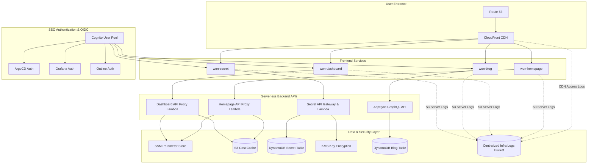

# your-project-name-terraform: 중앙 집중형 AWS 인프라 제어 및 멀티 서비스 통합 모니터링 허브

본 프로젝트는 AWS 클라우드 기반의 다양한 독립형 웹 서비스군(인증, 모니터링 대시보드, 비밀번호 관리자, 블로그, 위키 등)을 단일 코드로 통합 배포하고 관리하기 위한 AWS 서버리스 인프라 자동화(IaC) 솔루션입니다. 

Terraform을 활용한 선언적 인프라 구성을 바탕으로 하며, 각 독립 서비스 간의 OIDC 통합 인증 체계 및 배포 상태(tfstate) 파싱을 통한 중앙 집중형 대시보드 모니터링 시스템을 구축합니다.

---

## 1. 시스템 아키텍처 및 서비스 연동 구성

전체 인프라는 CloudFront CDN과 Route53을 전면 진입점으로 삼고 있으며, 각 독립 모듈들이 상호 유기적으로 연동되는 마이크로 서버리스 아키텍처로 설계되었습니다.



---

## 2. 주요 연동 인프라 모듈

### 2.1. 원격 백엔드 자동 구성 (backend)
* AWS S3 및 DynamoDB 상태 잠금 기능을 이용한 안정적인 테라폼 원격 상태(tfstate) 백엔드 환경을 자동으로 구축합니다.
* 다중 개발 협업 시 상태 충돌을 방지하기 위한 Lock Table(DynamoDB) 연동을 보장합니다.

### 2.2. OIDC 통합 SSO 서비스 (cognito)
* AWS Cognito User Pool을 통해 사내 인프라 및 관리 도구(ArgoCD, Grafana, Outline 등)의 OAuth 2.0 및 OpenID Connect(OIDC) 인증 인프라를 단일 테넌트로 일원화합니다.
* 각 서비스별 App Client 구성 및 Callback URL을 커스텀 도메인 규격에 맞춰 안전하게 프로비저닝합니다.

### 2.3. 통합 리소스 제어 및 비용 수집 대시보드 (won-dashboard)
* S3 백엔드에 보관된 `terraform.tfstate` 원시 데이터를 Lambda 함수가 실시간으로 분석하여 전체 AWS 배포 리소스를 파싱 및 목록화합니다.
* AWS Cost Explorer API를 호출하여 비용 사용 데이터를 수집하고 이를 S3 비용 캐시 버킷(`aws-cost-cache.json`)에 최적화하여 적재하는 백그라운드 배치 크롤러 아키텍처를 구현합니다.

### 2.4. KMS Envelope 암호화 비밀 관리자 (won-secret)
* 대칭 키 암호화 규격(KMS Key)을 활용하여 클라이언트에서 전송되는 민감 필드를 API Gateway와 Lambda 환경 내에서 복호화 및 실시간 암호화 처리합니다.
* 암호화된 기밀 항목들은 DynamoDB에 적재되어 안전하게 보관됩니다.

### 2.5. 확장형 AppSync 서버리스 블로그 (won-blog)
* AWS AppSync(Managed GraphQL API)와 DynamoDB를 결합하여 높은 트래픽 속에서도 스케일 아웃이 보장되는 데이터 API 레이어를 프로비저닝합니다.
* S3 이미지 업로드 및 CloudFront CDN 배포 아키텍처가 결합되어 완전한 서버리스 블로그 백엔드 토폴로지를 구성합니다.

### 2.6. 보안 감사 및 중앙 로깅 (Audit Trail)
* SonarQube Security Hotspots의 보안 권고 표준에 맞추어, 인프라 내의 모든 정적 버킷 및 콘텐츠 전송 네트워크(CDN) 배포판에 서버 액세스 로그 수집을 활성화하였습니다.
* **이중 감사 추적 (Double Logging) 메커니즘**:
  * **S3 서버 액세스 로깅**: 내부 AWS 자원(Lambda, AppSync 등)이 S3 API를 통해 버킷 자산(비용 캐시 JSON, 업로드 이미지 등)에 직접 접근하거나 조작(GetObject/PutObject)하는 모든 내부 스토리지 감사 이력을 기록합니다.
  * **CloudFront CDN 요청 로깅**: 인터넷 외부 사용자가 엣지 서버를 거쳐 웹 애플리케이션에 도달하는 모든 HTTP/HTTPS 인바운드 트래픽(접속 IP, URI, User-Agent 등)을 정밀하게 기록합니다.
* **중앙 집중형 로그 저장**: environments/main/ 레벨에 단일화된 S3 로깅 버킷(`infra_logs`)을 배포하고, 다른 모든 모듈(자체 웹 에셋 S3, 비용 캐시 버킷 등)의 S3 버킷 로깅 대상을 이 버킷으로 통일하여 관리 복잡성을 해소하였습니다.
* **CloudFront CDN 요청 로깅**: 외부 HTTP/HTTPS 접근의 정밀 모니터링을 위해 CloudFront API 요청 이력을 중앙 로그 S3 버킷에 압축 적재(Access Log)함으로써 보안성 검토 및 위협 분석 기반을 보장합니다.

---

## 3. 디렉터리 구조 및 레이아웃

```
.
├── environments/
│   └── main/                 # 실제 테라폼 실행 및 배포 환경 구성
│       ├── main.tf           # 전체 서브 모듈 통합 호출
│       ├── provider.tf       # AWS Provider 및 s3 Backend 설정
│       ├── variables.tf      # 입력 변수 정의
│       └── terraform.tfvars.example # 사용자 환경설정용 변수 템플릿
├── modules/
│   ├── backend/              # S3 Backend 구성 모듈
│   ├── cognito/              # OIDC SSO 사용자 인증 모듈
│   ├── lambda-shared/        # 공통 Lambda 래퍼 유틸 패키지
│   ├── outline/              # 위키 서비스 S3 및 IAM 연동 모듈
│   ├── won-blog/             # AppSync 기반 서버리스 블로그 모듈
│   ├── won-dashboard/        # tfstate 파서 및 모니터링 API 대시보드 모듈
│   ├── won-homepage/         # 진입 웹사이트 CDN 호스팅 인프라 모듈
│   └── won-secret/           # KMS 암호화 비밀값 관리 모듈
├── package.json              # 테스트 프레임워크 스크립트 정의
└── vitest.config.mjs         # Vitest 통합 단위 테스트 설정 파일
```

---

## 4. 시작하기 (Getting Started)

### 4.1. 사전 준비사항
* Terraform v1.15.x 이상
* AWS CLI v2 이상 (배포 권한이 셋업된 IAM 사용자 계정 인증 필요)
* Node.js v22 LTS 이상 (Lambda 단위 테스트 검증용)

### 4.2. 설정 파일 복사 및 작성
`environments/main/` 경로 하위의 템플릿 파일을 복사하여 실제 환경 변수 파일을 생성합니다.

```bash
cd environments/main
cp terraform.tfvars.example terraform.tfvars
```

이후 `terraform.tfvars` 파일을 열고 본인의 AWS 리전, 루트 도메인 정보 및 리소스 구성을 기입합니다.

### 4.3. 인프라 배포 절차
```bash
# 1. 테라폼 공급자 및 모듈 초기화
terraform init

# 2. 배포 예상 계획 검토
terraform plan

# 3. AWS 실제 클라우드 환경에 리소스 배포 적용
terraform apply
```

---

## 5. 단위 테스트 실행 및 검증 (Vitest)

본 프로젝트는 Lambda 함수들의 동작 보장 및 무결성을 위해 `Vitest` 테스트 러너 기반의 단위 테스트 세트를 내포하고 있습니다.

```bash
# 1. 개발 및 테스트 의존성 패키지 설치
npm install

# 2. 전체 Lambda 단위 테스트 일회성 실행
npm run test

# 3. 테스트 커버리지 리포트 생성
npm run test:coverage
```

---

## 6. IaC 정적 분석 및 보안 검증 (Security Scan)

> [!NOTE]
> 본 정적 분석 도구들은 로컬에 작성된 테라폼 코드(.tf)의 구문 및 컴플라이언스 설정만 검사하며, 실제 AWS 클라우드 리소스를 생성, 수정 또는 파괴하지 않는 물리적으로 완전히 안전한 정적 코드 검사기입니다.

본 프로젝트는 안전하고 표준화된 클라우드 보안 컴플라이언스를 준수하기 위해 IaC 정적 분석 도구(`tfsec`, `checkov`) 사용을 적극 권장합니다. 배포 전 아래 도구를 통해 보안 취약점을 자가 검증할 수 있습니다.

### 6.1. tfsec 보안 진단
```bash
# 1. tfsec 설치 (Mac OS Homebrew 기준)
brew install tfsec

# 2. environments/main/ 디렉터리 내 테라폼 코드 스캔
tfsec environments/main
```

### 6.2. Checkov 컴플라이언스 진단
```bash
# 1. checkov 설치 (Python pip 기준)
pip install checkov

# 2. 전체 디렉터리 대상 테라폼 프레임워크 스캔
checkov -d . --framework terraform
```

